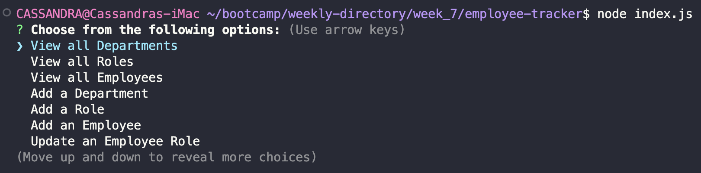

# Employee Tracker

## Description

View and manage the departments, roles, and employees in your company.

## Installation

1. Install [Node.js](https://nodejs.org/en).
2. Clone or fork the [repo](https://github.com/scelsic2/employee-tracker).
3. Open the repo with VS Code.
4. Open an integrated terminal in the repo folder.
5. In the terminal, run `npm init`.
6. In the terminal, run `npm install inquirer`.
7. In the terminal, run `npm install mysql2`.
7. In the terminal, run `npm install console.table`.

## Usage

Run `node index.js` in the terminal access each prompt.

Result from selecting View Department.

Result from selecting Add a Department, then View a Department

View all Employee Roles, Add a Role, and then View again to see updates.

View all Employees, Add an Employee, and then View again to see updates.

View all Employees, Update Employees, then View Employees to see updates.

## Credits
- https://www.npmjs.com/package/mysql2
- https://www.npmjs.com/package/inquirer/v/8.2.4
- https://www.npmjs.com/package/console.table
- https://www.knowledgehut.com/blog/web-development/node-js-process-exit
- https://www.w3schools.com/sql/sql_join_self.asp
- Office Hours 12APR2023
- Tutoring 12APR2023
- Office Hours 13APR2023
- Tutoring 13APR2023

## License

MIT License

## Deployed Application Link
<!-- 
Paste your deployed application link here. -->
